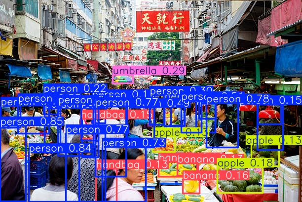
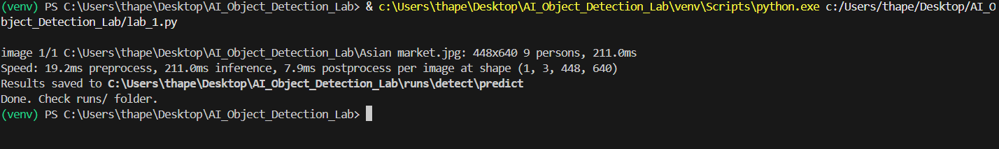
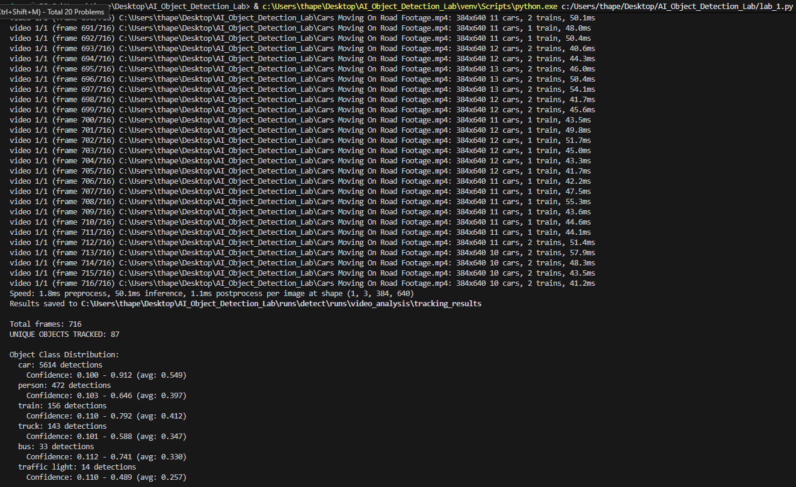
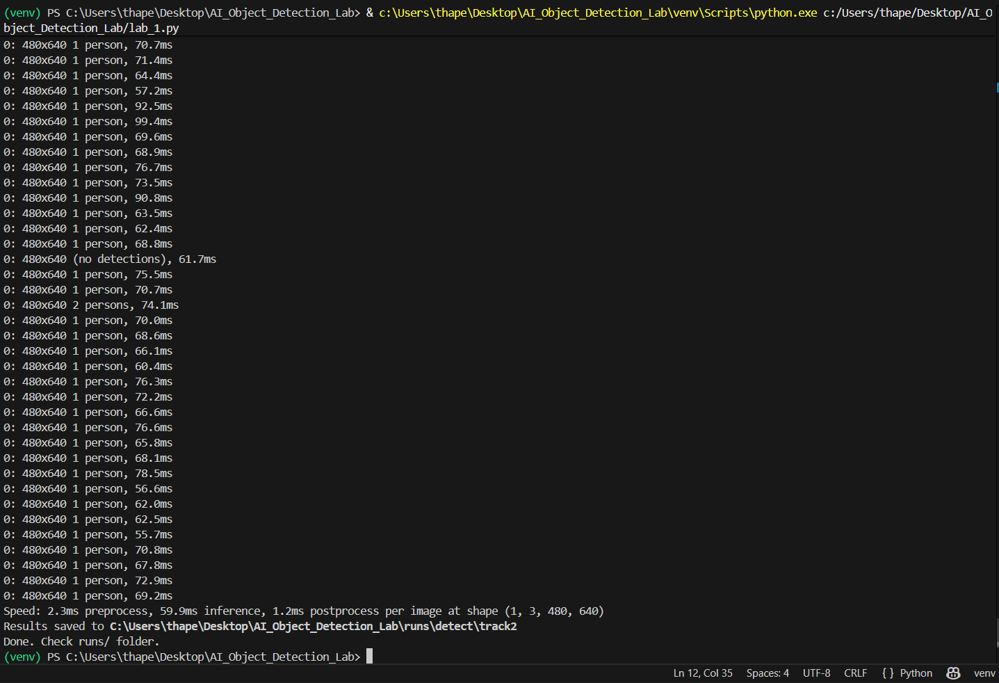

# 🧠 AI Object Detection with YOLOv8


A Python project that demonstrates **real-time object detection and tracking** using the
pretrained YOLOv8 model. Developed as **Lab 1** for the *CMPG 313 Artificial Intelligence*
practical assessment.

---

## 📋 Table of Contents

- [Project Summary](#-project-summary)
- [Technologies Used](#-technologies-used)
- [Repository Structure](#-repository-structure)
- [Installation](#-installation)
- [How to Run](#-how-to-run)
- [Example Outputs](#-example-outputs)
- [Screenshots](#-screenshots)
- [What I Learned](#-what-i-learned)
- [Real-World Applications](#-real-world-applications)
- [Author](#-author)

---

## 📝 Project Summary

This project implements three core computer-vision tasks using the
[Ultralytics YOLOv8](https://github.com/ultralytics/ultralytics) model:

| Task | Input | Output |
|------|-------|--------|
| **Object Detection** | Static image (`Asian market.jpg`) | Annotated image with bounding boxes |
| **Object Tracking** | Video file (`Cars Moving On Road Footage.mp4`) | Annotated video with persistent object IDs |
| **Real-Time Detection** | Live webcam feed | Live display window (press **q** to quit) |

The script uses the lightweight `yolov8n` (nano) variant pretrained on the
[COCO dataset](https://cocodataset.org) (80 object classes).

---

## 🛠 Technologies Used

| Tool / Library | Purpose |
|----------------|---------|
| **Python 3.8+** | Core programming language |
| **Ultralytics YOLOv8** | Object detection & tracking model |
| **OpenCV** | Image/video I/O and display |
| **Command Prompt / Terminal** | Script execution |

---

## 📁 Repository Structure

```
AI_Object_Detection/
│
├── README.md                        # Project documentation (this file)
├── requirements.txt                 # Python dependencies
├── lab_1.py                         # Main detection & tracking script
│
├── data/
│   ├── test_image.jpg               # Input test image
│   └── test_video.mp4               # Input test video
│
├── results/
│   ├── image_detection_output.jpg   # Annotated image output
│   ├── video_tracking_output.mp4    # Annotated video output
│   └── webcam_demo.mp4              # Recorded webcam demo (optional)
│
├── screenshots/
│   ├── cmd_execution.png            # CMD/terminal execution screenshot
│   ├── image_detection_result.png   # Detection result screenshot
│   └── video_tracking_result.png    # Tracking result screenshot
│
└── docs/
    └── project_explanation.md       # Detailed technical explanation
```

---

## ⚙️ Installation

### Prerequisites

- Python 3.8 or higher
- pip

### Steps

1. **Clone the repository**

   ```bash
   git clone https://github.com/Naxisbeast/AI_Object_Detection.git
   cd AI_Object_Detection
   ```

2. **Create and activate a virtual environment** *(recommended)*

   ```bash
   python -m venv venv

   # Windows
   venv\Scripts\activate

   # macOS / Linux
   source venv/bin/activate
   ```

3. **Install dependencies**

   ```bash
   pip install -r requirements.txt
   ```

   > The YOLOv8 nano weights (`yolov8n.pt`) are downloaded automatically on first run.

---

## ▶️ How to Run

Place your test image at `data/test_image.jpg` and your test video at `data/test_video.mp4`,
then run:

```bash
python lab_1.py
```

You can also override the default paths or swap in a larger YOLOv8 variant:

```bash
# Use a different model (e.g. yolov8s for better accuracy)
python lab_1.py --model yolov8s.pt

# Use custom input files
python lab_1.py --image path/to/image.jpg --video path/to/video.mp4
```

The script will execute all three tasks in sequence:

```
============================================================
  Lab 1 – YOLOv8 Object Detection & Tracking
============================================================

[1/3] Running object detection on image...
    Detection complete. Output saved to: results/image_detection_output.jpg

[2/3] Running object tracking on video...
    Tracking complete (120 frames). Output saved to: results/video_tracking_output.mp4

[3/3] Starting real-time webcam detection (press 'q' to quit)...
    Webcam session ended.

All tasks complete.
```


---

## 🖼 Example Outputs

### Image Detection

The model draws bounding boxes and class labels on the input image:



### Video Tracking

Each object is assigned a persistent tracking ID that is maintained across frames:


### Webcam Execution

Screenshot of the script running in the Webcam:


---

## 📸 Screenshots

| Task | Screenshot |
|------|-----------|
| Image Detection |  |
| Video Tracking |  |
| Webcam Execution |  |

---

## 💡 What I Learned

- How **pretrained deep-learning models** (YOLOv8) can be applied to real-world computer
  vision problems with minimal setup.
- The difference between **object detection** (locate + classify in a single frame) and
  **object tracking** (maintain consistent identities across frames).
- How to use **OpenCV** to read, process, and write images and videos programmatically.
- Practical use of **confidence thresholds** to balance precision and recall.
- How to structure a Python project professionally with clear separation of code, data, and
  results.

---

## 🌍 Real-World Applications

| Domain | Application |
|--------|-------------|
| **Security & Surveillance** | Automated intruder or anomaly detection in CCTV footage |
| **Autonomous Vehicles** | Pedestrian, vehicle, and obstacle detection |
| **Retail Analytics** | Customer counting, shelf-stock monitoring |
| **Sports Analytics** | Player and ball tracking in broadcast footage |
| **Healthcare** | Medical image analysis and anomaly detection |
| **Manufacturing** | Defect detection on production lines |

---

## 👤 Author

**Naxisbeast**  
BSc Computer Science – Artificial Intelligence  
[GitHub](https://github.com/Naxisbeast)

> *Developed as part of the CMPG 313 Artificial Intelligence practical assessment.*

